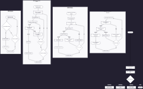
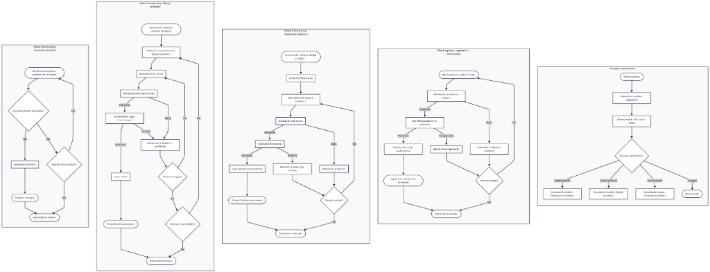

# Wirtualna Półka - Dokumentacja Projektu

## Spis Treści
1. [Opis Projektu](#opis-projektu)
2. [Architektura Systemu](#architektura-systemu)
3. [Technologie](#technologie)
4. [Struktura Projektu](#struktura-projektu)
5. [Endpointy API](#endpointy-api)
6. [Model Danych](#model-danych)
7. [Instalacja i Uruchomienie](#instalacja-i-uruchomienie)
8. [Dane Logowania](#dane-logowania)
9. [Diagramy Przepływu](#diagramy-przepływu)

---

## Opis Projektu

**Wirtualna Półka** to system zarządzania magazynem typu "Digital Twin" (cyfrowy bliźniak), który umożliwia wizualizację i zarządzanie produktami na wirtualnych półkach sklepowych. System pozwala na:

- **Logowanie i autoryzację** użytkowników
- **Zarządzanie produktami** (dodawanie, edytowanie, usuwanie)
- **Kategoryzację produktów** w grupy tematyczne
- **Monitorowanie stanów magazynowych** z ostrzeżeniami o niskim stanie
- **Przesyłanie zdjęć produktów** do wizualizacji

---

## Architektura Systemu

System oparty jest na architekturze **SPA (Single Page Application)** z rozdzielonym frontendem i backendem:

```
┌─────────────────┐         ┌─────────────────┐         ┌─────────────────┐
│    Frontend     │  HTTP   │     Backend     │   SQL   │    Database     │
│    (Vue 3)      │◄───────►│   (Laravel 12)  │◄───────►│    (SQLite)     │
│    Port 5173    │   API   │    Port 8000    │         │                 │
└─────────────────┘         └─────────────────┘         └─────────────────┘
```

### Warstwy aplikacji:
- **Prezentacji (Frontend)**: Vue 3, Pinia, Tailwind CSS
- **Logiki biznesowej (Backend)**: Laravel 12, Sanctum (autoryzacja)
- **Danych (Database)**: SQLite

---

## Technologie

### Backend
| Technologia | Wersja | Zastosowanie |
|-------------|--------|--------------|
| PHP | 8.2+ | Język programowania |
| Laravel | 12.x | Framework webowy |
| Sanctum | - | Autoryzacja tokenowa API |
| SQLite | 3.x | Baza danych (lekka, plikowa) |

### Frontend
| Technologia | Wersja | Zastosowanie |
|-------------|--------|--------------|
| Vue.js | 3.x | Framework UI (Composition API) |
| Pinia | - | Zarządzanie stanem aplikacji |
| Tailwind CSS | 4.x | Stylowanie komponentów |
| Axios | - | Komunikacja HTTP z API |
| Vue Router | - | Routing po stronie klienta |

---

## Struktura Projektu

```
StoreManaging/
├── backend/                    # Serwer Laravel
│   ├── app/
│   │   ├── Http/
│   │   │   └── Controllers/
│   │   │       ├── AuthController.php      # Logowanie/wylogowanie
│   │   │       ├── ProductController.php   # CRUD produktów
│   │   │       └── CategoryController.php  # CRUD kategorii
│   │   └── Models/
│   │       ├── Product.php                 # Model produktu
│   │       ├── Category.php                # Model kategorii
│   │       └── User.php                    # Model użytkownika
│   ├── database/
│   │   ├── migrations/                     # Migracje bazy danych
│   │   └── seeders/                        # Dane początkowe
│   └── routes/
│       └── api.php                         # Definicje endpointów API
│
├── frontend/                   # Klient Vue.js
│   └── src/
│       ├── components/                     # Komponenty wielokrotnego użytku
│       │   ├── ProductCard.vue
│       │   ├── ProductForm.vue
│       │   └── Modal.vue
│       ├── views/                          # Widoki (strony)
│       │   ├── LoginView.vue               # Strona logowania
│       │   └── ShelfView.vue               # Główny widok półki
│       ├── stores/                         # Stan aplikacji (Pinia)
│       │   ├── auth.ts                     # Stan autoryzacji
│       │   └── product.ts                  # Stan produktów
│       └── router/
│           └── index.ts                    # Konfiguracja routingu
│
├── README.md                   # Dokumentacja (EN)
└── DOKUMENTACJA.md             # Dokumentacja (PL)
```

---

## Endpointy API

### Autoryzacja

| Metoda | Endpoint | Opis | Autoryzacja |
|--------|----------|------|-------------|
| `POST` | `/api/login` | Logowanie użytkownika | ❌ Publiczny |
| `POST` | `/api/logout` | Wylogowanie użytkownika | ✅ Wymagana |
| `GET` | `/api/user` | Pobranie danych zalogowanego użytkownika | ✅ Wymagana |

### Produkty

| Metoda | Endpoint | Opis | Autoryzacja |
|--------|----------|------|-------------|
| `GET` | `/api/products` | Lista wszystkich produktów | ✅ Wymagana |
| `GET` | `/api/products?category_id={id}` | Filtrowanie po kategorii | ✅ Wymagana |
| `GET` | `/api/products?search={query}` | Wyszukiwanie produktów | ✅ Wymagana |
| `POST` | `/api/products` | Dodanie nowego produktu | ✅ Wymagana |
| `GET` | `/api/products/{id}` | Szczegóły produktu | ✅ Wymagana |
| `PUT/PATCH` | `/api/products/{id}` | Aktualizacja produktu | ✅ Wymagana |
| `DELETE` | `/api/products/{id}` | Usunięcie produktu | ✅ Wymagana |

### Kategorie

| Metoda | Endpoint | Opis | Autoryzacja |
|--------|----------|------|-------------|
| `GET` | `/api/categories` | Lista wszystkich kategorii | ❌ Publiczny |
| `GET` | `/api/categories/{id}` | Szczegóły kategorii | ❌ Publiczny |
| `POST` | `/api/categories` | Dodanie nowej kategorii | ✅ Wymagana |
| `DELETE` | `/api/categories/{id}` | Usunięcie kategorii | ✅ Wymagana |

---

## Model Danych

### Produkt (`products`)

| Pole | Typ | Opis |
|------|-----|------|
| `id` | INTEGER | Unikalny identyfikator |
| `name` | VARCHAR(255) | Nazwa produktu |
| `description` | TEXT (nullable) | Opis produktu |
| `image` | VARCHAR (nullable) | Ścieżka do zdjęcia |
| `category_id` | INTEGER (nullable) | Klucz obcy do kategorii |
| `price` | DECIMAL(10,2) | Cena produktu (PLN) |
| `stock_quantity` | INTEGER | Aktualna ilość w magazynie |
| `minimum_stock` | INTEGER (nullable) | Minimalny stan magazynowy |
| `created_at` | TIMESTAMP | Data utworzenia |
| `updated_at` | TIMESTAMP | Data ostatniej modyfikacji |

### Kategoria (`categories`)

| Pole | Typ | Opis |
|------|-----|------|
| `id` | INTEGER | Unikalny identyfikator |
| `name` | VARCHAR(50) | Nazwa kategorii |
| `slug` | VARCHAR | Przyjazny URL |
| `created_at` | TIMESTAMP | Data utworzenia |
| `updated_at` | TIMESTAMP | Data ostatniej modyfikacji |

### Użytkownik (`users`)

| Pole | Typ | Opis |
|------|-----|------|
| `id` | INTEGER | Unikalny identyfikator |
| `name` | VARCHAR(255) | Imię i nazwisko |
| `email` | VARCHAR(255) | Adres e-mail (unikalny) |
| `password` | VARCHAR | Zaszyfrowane hasło |
| `created_at` | TIMESTAMP | Data utworzenia |
| `updated_at` | TIMESTAMP | Data ostatniej modyfikacji |

### Relacje

```
┌─────────────┐       ┌─────────────┐
│  Category   │───1:N─│   Product   │
└─────────────┘       └─────────────┘
```

Jedna kategoria może zawierać wiele produktów. Produkt może nie mieć przypisanej kategorii (kategoria "Inne").

---

## Instalacja i Uruchomienie

### Wymagania Wstępne

- **PHP** 8.2 lub nowszy
- **Composer** (menedżer pakietów PHP)
- **Node.js** 18+ i **npm**
- **Git**

### Backend

```bash
# 1. Przejdź do katalogu backend
cd backend

# 2. Zainstaluj zależności PHP
composer install

# 3. Skopiuj plik konfiguracji środowiska
cp .env.example .env

# 4. Wygeneruj klucz aplikacji
php artisan key:generate

# 5. Utwórz bazę danych SQLite
touch database/database.sqlite

# 6. Uruchom migracje i seedery (dane początkowe)
php artisan migrate --seed

# 7. Utwórz link do przechowywania plików publicznych
php artisan storage:link

# 8. Uruchom serwer deweloperski
php artisan serve
```

Serwer będzie dostępny pod adresem: `http://localhost:8000`

### Frontend

```bash
# 1. Przejdź do katalogu frontend
cd frontend

# 2. Zainstaluj zależności Node.js
npm install

# 3. Uruchom serwer deweloperski
npm run dev
```

Aplikacja będzie dostępna pod adresem: `http://localhost:5173`

---

## Dane Logowania

> [!IMPORTANT]
> Poniższe dane są ustawiane automatycznie przez seeder bazy danych.

| Pole | Wartość |
|------|---------|
| **E-mail** | `admin@spoko.pl` |
| **Hasło** | `admin` |

### Tworzenie nowego użytkownika (opcjonalnie)

```bash
php artisan tinker
```

```php
User::factory()->create([
    'name' => 'Nowy Admin',
    'email' => 'nowy@email.pl',
    'password' => Hash::make('twoje-haslo')
]);
```

---

## Diagramy Przepływu

Poniżej znajdują się diagramy przepływu ilustrujące główne procesy w systemie:

### Przegląd Diagramów



### Szczegółowe Diagramy



Diagramy przedstawiają następujące procesy:
1. **Usuwanie produktu** - przepływ usuwania produktu z potwierdzeniem
2. **Edycja produktu** - walidacja i aktualizacja danych produktu
3. **Dodawanie produktu** - tworzenie nowego produktu z walidacją
4. **Logowanie i wylogowanie** - autoryzacja użytkownika z tokenem
5. **Struktura modułów** - architektura komponentów systemu

---

## Licencja

Ten projekt jest udostępniony do celów edukacyjnych.

---

*Ostatnia aktualizacja: Styczeń 2026*
